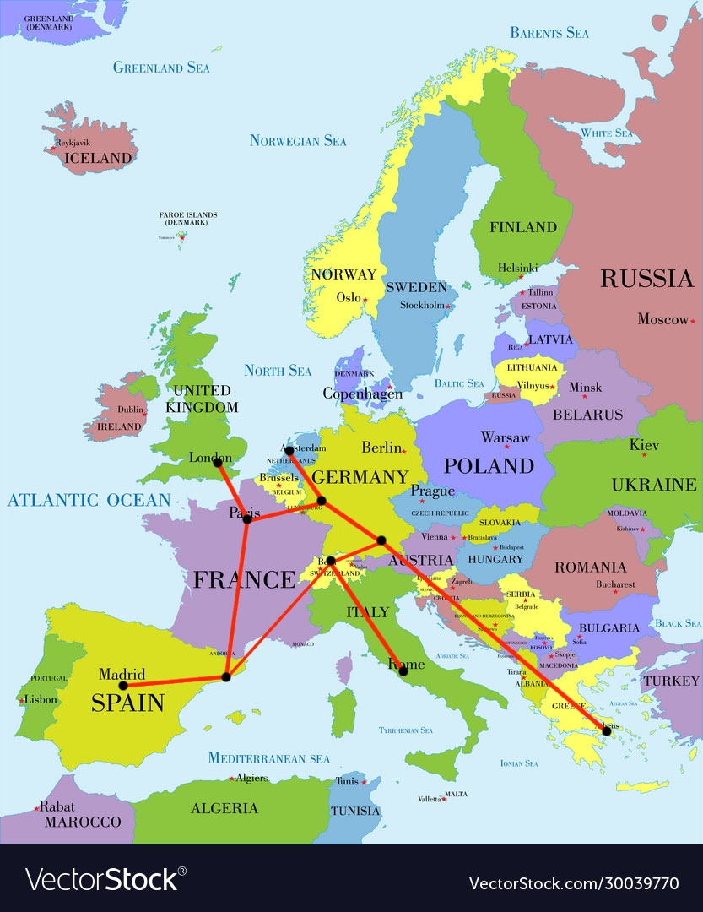

# letalski-promet

 Aplikacija `bottle.py`

To je repozitorij projekta pri predmetu Osnove podatkovnih baz. 

Projekt skuša posnemati delovanje letalskega prometa. Dostop do aplikacije se deli na: dostop potnikov, dostop organizatorjev in dostop administratorja. Kot prikazano na spodnji sliki, je v bazi dodanih 10 letališč in 20 rednih letov med njimi. Potnik lahko izbira med poljubnima letališčema iz spodnje slike, prav tako pa se lahko odloči za čarterski let, ki ga je dodal eden od organizatorjev oz. administrator.

## Dostop potnika

Na začetni strani se pod orodno vrstico nahaja obrazec v katerega uporabnik vnese želena kraja, datuma odhoda in vrnitve, razred in vrsto potovanja, t. j. enosmerno ali dvosmerno. Aplikacija z Dijkstrinim algoritmom izračuna najcenejšo pot in uporabnika preusmeri na stran za nakup kart. Pred vsakim nakupom kart uporabnik vnese želeno število kart, prav tako pa lahko spremeni razred. 

Pod obrazcem za izbiro leta se nahajajo tri slike s povezavami na last-minute lete, vroče lete in čarterske lete. Last-minute leti so leti, ki se bodo izvedli v roku naslednjih treh dni, vroči leti, leti, ki so najbolj priljubljeni, v smislu, da je bilo zanje prodanih največ sedežev ekonomskega razreda, čarterski leti pa leti, ki so jih vnesli organizatorji.

Uporabnik prav tako lahko pregleda karte, ki jih je kupil, si spremeni geslo in pregleda svoj profil.

## Dostop organizatorja letov

Organizator letov lahko organizira lete v smislu, da obstoječe preuredi oz. izbriše, ali pa let doda na novo. Organizatorje v bazo vnese administrator.

## Dostop administratorja

Administrator je v resnici tip uporabnika, ki se v bazo vnese že s samim uvozom podatkov. Poleg urejanja in dodajanja letov ima prav tako možnost pregleda nad organizatorji in uporabnikov ter obojim lahko ureja podatke ali pa jih odstrani. 

